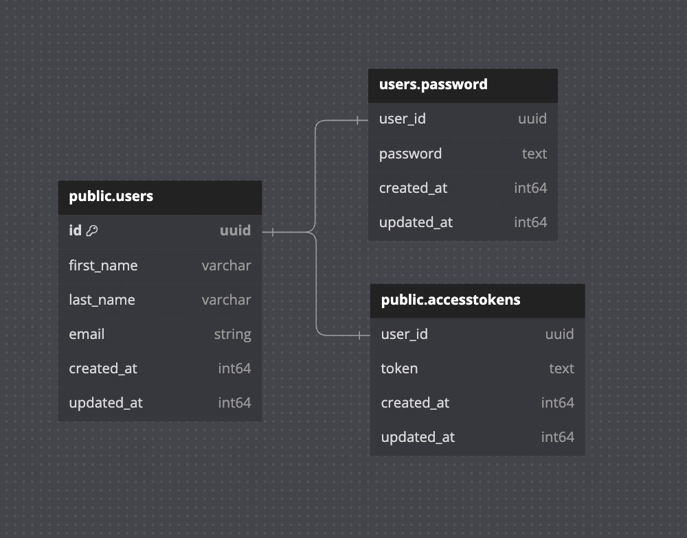

# ASSIGNMENT-1

## **Introduction**

Feature
- Login, Logout.
- CRUD Users.
- Reset Password.
    

## **Installation**

Run with docker compose:

1. Run compose **`docker compose up -d`**

Run with local:

1. Navigate to the backend directory **`cd backend`**
2. Install dependencies: **`go mod vendor`**
3. Connect database look up cert in .env file **[ENV](https://github.com/tigerbaboon/solidithai-test/blob/main/assignment1/backend/.env)**
4. Migrate table to database & create default user **`go run . migrate`**
6. Navigate to the frontend directory **`cd frontend`**
7. Install dependencies use npm | pnpm | yarn | bun: **`yarn install`**

## **Usage**

User Admin:

- email: **`admin@mail.com`**
- password: **`123456789`**

Run with docker compose:

1. Backend started server on `http://localhost:8080`
2. Frontend started server on `http://localhost:3000`

Run with local:

1. Navigate to the backend directory **`cd backend`**
2. Backend start **`go run . http`**
3. Navigate to the frontend directory **`cd frontend`**
4. Frontend start the development server on `http://localhost:3000`:
    - **`npm run dev`**
    - **`pnpm dev`**
    - **`yarn dev`**
    - **`bun run dev`**

## **Api Doc**

- **Auth**
    - **POST** `/api/auth/login`
        - Login.

    - **POST** `/api/auth/logout`
        - Logout.

- **Users**
    - **GET** `/api/users`
        - Retrieves a list of all users.

    - **GET** `/api/users/:id`
        - Retrieves a specific user by ID.

    - **POST** `/api/users`
        - Creates a new user.

    - **PUT** `/api/users/:id`
        - Updates an existing user.

    - **DELETE** `/api/users/:id`
        - Remove a user.

    - **PATCH** `/api/users/:id/password`
        - Reset password a user.

## **ER Diagram**

